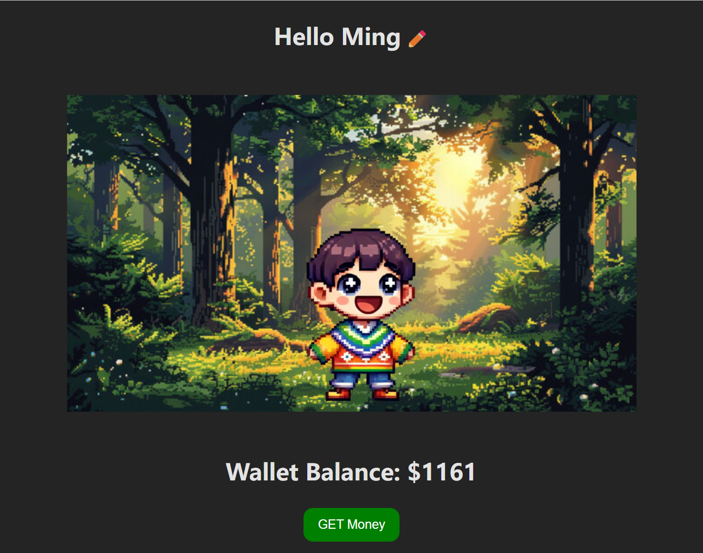
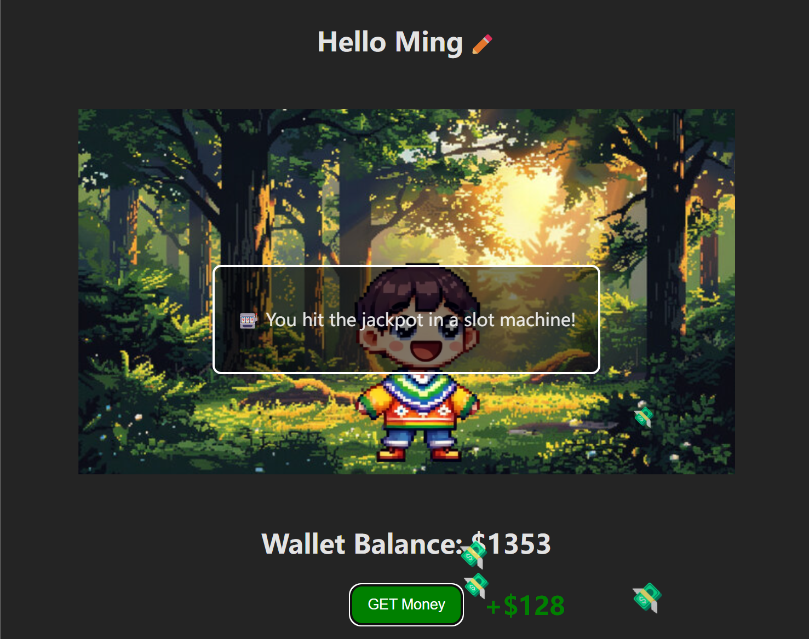

# DayDream Simulator

## Game Overview
Daydream Simulator is a simple game designed for one purpose—to make you happy.  
Click the "GET Money" button, watch your wealth grow, and enjoy the fun surprises along the way. No stress, no pressure—just a little escape into a daydream. Your progress is saved, so you can always come back and continue your journey.

---

## Features
- **Earn money by clicking the button** 
- **Random events for extra rewards** 
- **Animated falling money effect** 
- **Sound effects for a more immersive experience**
- **Local storage for balance and username**
- **Customizable username** 
- **Mobile-friendly design**

---

## Visit the website

visit: "https://daydream-ming.vercel.app/"

---

## How to Play
1. Enter your username and save it.
2. Click the **“GET Money”** button to earn money.
3. Random events may trigger, giving you extra rewards.
4. Your balance is automatically saved, so you don’t lose your balance.

---

## Screenshots

---

## Tech Stack
- **React.js** 
- **CSS (animations & effects)** 
- **LocalStorage (data persistence)** 

---

## Future Improvements  
✅ Introduce more random events 🎰  
✅ Add sound effects & background music 🎶  
✅ Optimize for mobile devices 📱  

---

## Contact
For any questions or suggestions, feel free to reach out:
Email: mingmingliu3517@gmail.com

